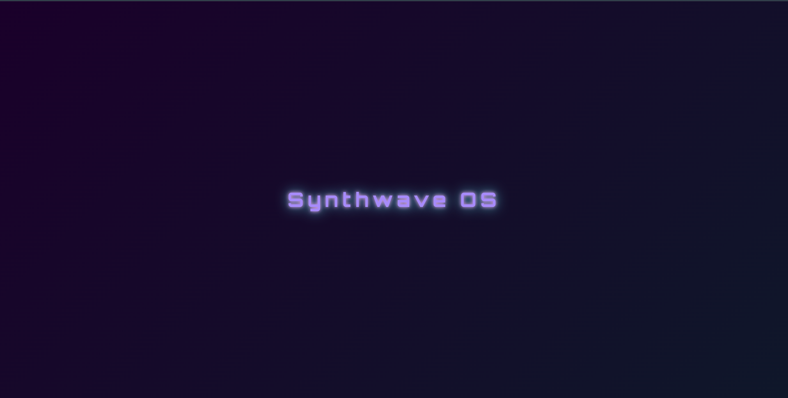
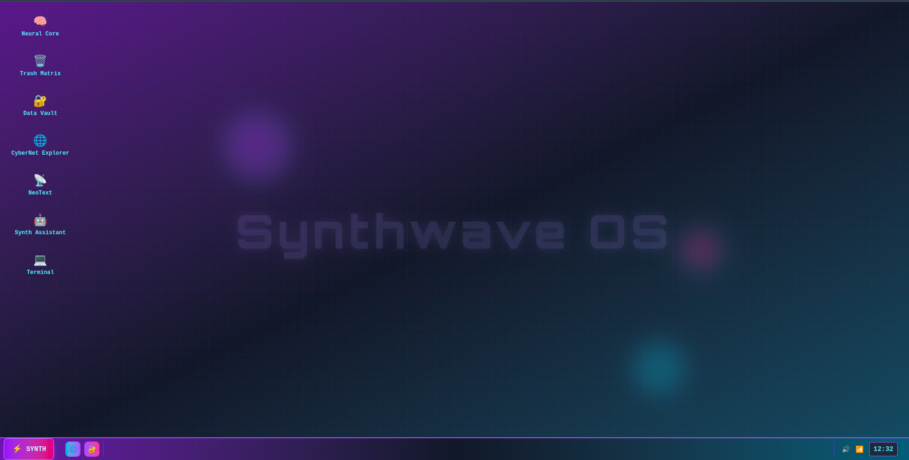
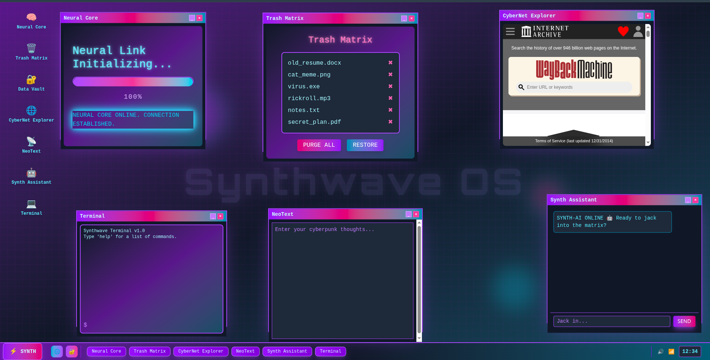
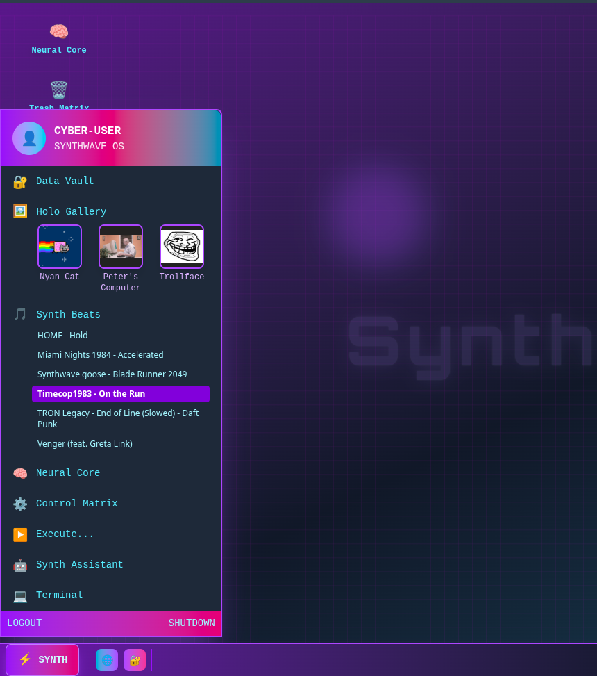

# SynthwaveOS

A futuristic, web-based desktop environment that fuses the nostalgia of classic Windows XP with the neon-drenched aesthetics of synthwave and cyberpunk. SynthwaveOS is a playful, interactive homage to the past, reimagined with modern web technologies and creative features.

> **Hackathon Theme:** Blast from the Past

---

## 🚀 What is SynthwaveOS?

SynthwaveOS is a browser-based "operating system" that brings together the familiar feel of Windows XP and the retro-futuristic vibes of synthwave. It features interactive desktop icons, a dynamic start menu, draggable/resizable windows, a built-in terminal, music player, meme gallery, and more—all wrapped in glowing neon grids and animated backgrounds.

---

## ✨ Features

- **Nostalgic Desktop UI:**  
  - Desktop icons, taskbar, start menu, windowed apps  
  - Draggable, resizable, and minimizable windows  
  - Synthwave-inspired neon grid and animated background

- **Functional Apps:**  
  - **Neural Core:** Futuristic loading/progress simulation  
  - **Trash Matrix:** Animated trash bin with purge/restore  
  - **Data Vault:** Embedded "Wide Putin" meme video  
  - **CyberNet Explorer:** Embedded web browser (archive.org)  
  - **NeoText:** Minimal notepad  
  - **Synth Assistant:** AI chatbot with retro responses  
  - **Terminal:** Basic command-line interface  
  - **Holo Gallery:** Meme image gallery  
  - **Synth Beats:** Built-in synthwave music player  
  - **Control Matrix:** System toggles, volume, and fake stats  
  - **Execute...:** Run dialog to launch apps by name

- **Synthwave Experience:**  
  - Neon gradients, animated orbs, flickering text, and subtle grid  
  - Subtle watermark and boot animation  
  - Sound effects for clicks and actions

---

## 🕹️ How does it fit the theme? (Blast from the Past)

SynthwaveOS is a creative reimagining of the Windows XP desktop—a true "blast from the past"—but with a twist: everything is wrapped in synthwave/cyberpunk style. It combines the comfort of a classic OS with the energy and color of retro-futurism, blending nostalgia and modern web tech for a unique, playful experience.

---

## 🛠️ Tech Stack

- **React** (Vite)
- **TailwindCSS**
- **react-rnd** (for draggable/resizable windows)
- **HTML5/CSS3**
- **Google Fonts (Orbitron, Share Tech Mono)**

---

## 💻 Installation & Usage

1. **Clone the Repository**
    ```bash
    git clone https://github.com/Aditya201D/hackathon_project.git
    cd hackathon_project
    ```

2. **Install Dependencies**
    ```bash
    npm install
    ```

3. **Run the Development Server**
    ```bash
    npm run dev
    ```
    Open [http://localhost:5173](http://localhost:5173) in your browser.

---

## 🌐 Deployment

> [Live Demo Coming Soon!](#)

---

## 👨‍💻 Authors

- Aditya Thakur (Aditya201D)
- Harshit Tyagi
- Kapil Kant

---

## 📝 How to Use

- **Double-click** desktop icons to open apps
- **Use the Start Menu** for more apps and features
- **Try the Terminal** for fun commands (`help`, `about`, `date`, etc.)
- **Play synthwave tracks** from the Synth Beats menu
- **Purge/restore files** in Trash Matrix
- **Chat with Synth Assistant** for retro AI fun
- **Try the "Run a Program" dialog** (Execute...) to launch apps by name

---

## 📸 Screenshots

> 
> Boot-up animation

>
>Desktop

>
>Desktop apps opened up

>
>Start-up menu
---

Enjoy your trip down memory lane—recharged with neon!